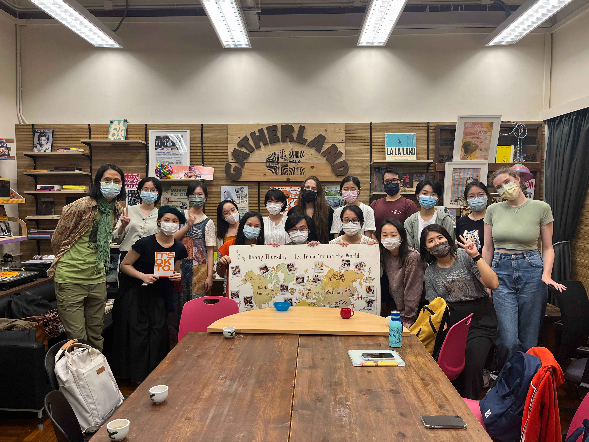

Tea: Indonesian Black Tea

Snacks: Klepon, Kue Lapis and Wajik

Fun fact: When being asked to describe Indonesia in one sentence, Ben said “Unity in Diversity”, a national motto from his country.



