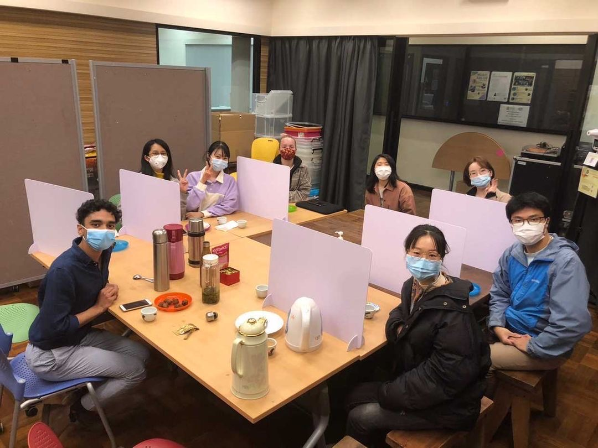

Tea: Bhaji (Potato Balls)

Snacks: Ginger and Cardamom Tea

Fun fact: Yusuf explained the way we call a beverage “tea” or “cha” reflects how it was introduced to a certain country by land or by sea. If it is called “tea”, it means it was transported by sea; and if it is called “cha”, it means by land.



