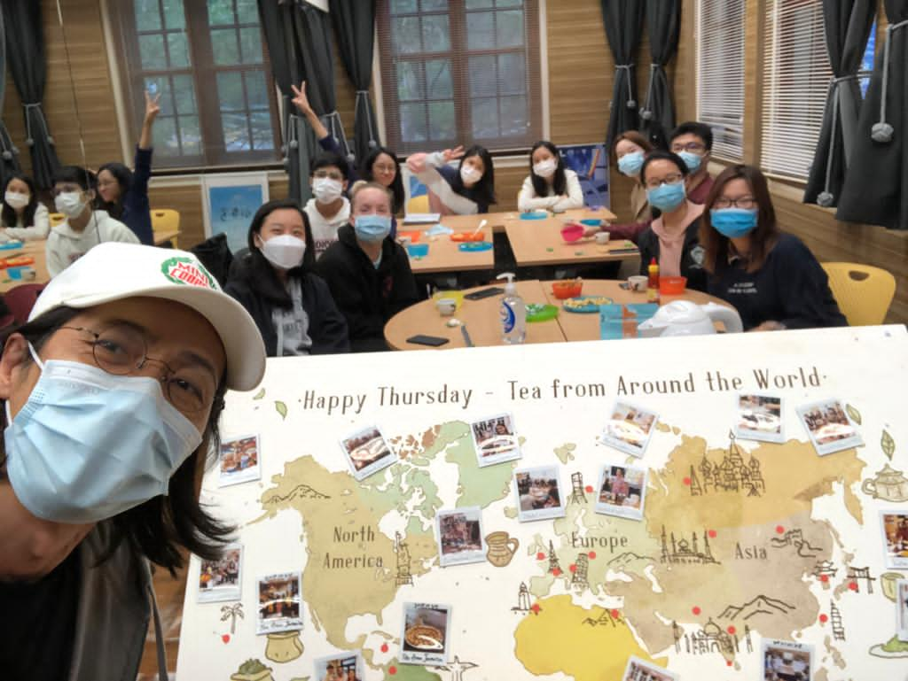

TCoffee: Cà Phê Phin (Vietnamese Filter Coffee)

Snacks: Kẹo dừa (Coconut Candy), Chicken Floss with Hot Chili Sauce, Dried Banana and Lotus

Fun fact: According to Alicia, even though Vietnam is famous for its filter coffee and craft coffee shops, most of the Vietnamese still prefer to drink instant coffee everyday!



